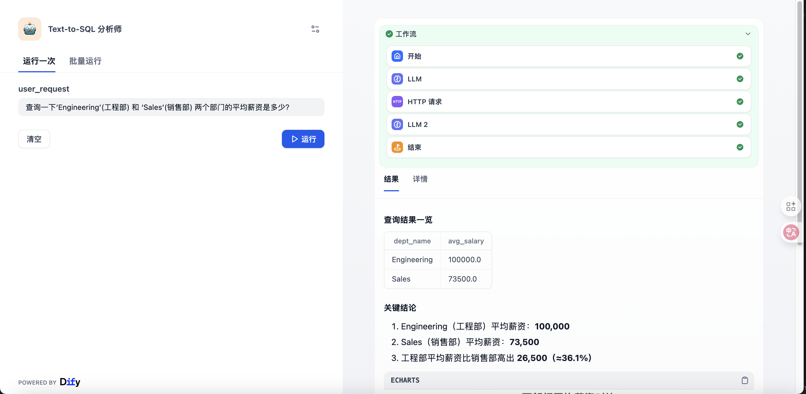

# Text-to-SQL 数据分析师

**Author:** `dugufeng`
**Tags:** `language:chinese`, `text-to-sql`, `database`, `mysql`, `deepseek-coder`, `kimi`, `echarts`

这是一个高级工作流，它充当一个“数据分析师”。它将用户的自然语言问题（基于一个示例数据库）转换为 SQL，执行查询，然后使用大模型将原始数据分析并总结为一份包含 ECharts 图表的报告。

## 🚀 关键前置条件 (Pre-conditions)

**警告：这是一个高级工作流模板，需要你自行搭建数据库和 API 才能运行。**

在运行此工作流之前，你 **必须** 准备好以下两个环境：

1.  **MySQL 数据库与 `employees` 数据集:**
    * 你需要一个正在运行的 MySQL 数据库。
    * 你必须在这个数据库中导入 `employees` 示例数据集。
    * *(PM 备注: 这是 Dify Prompt 中硬编码的 Schema。你可以从 [GitHub - datacharmer/test_db](https://github.com/datacharmer/test_db) 下载并导入这个数据集。)*

2.  **数据库 HTTP API 接口:**
    * 你需要一个**公开**的 HTTP API 端点（例如用 Python Flask, Node.js Express 搭建）。
    * Dify 会将生成的 SQL 语句 `POST` 到这个 API。
    * 你的 API 必须能接收 `{"sql_query": "SELECT..."}` 格式的 JSON，执行它，并以 JSON 格式返回查询结果。

---

## 🚀 如何使用

1.  **设置 LLM API 密钥:**
    * 此工作流依赖 `langgenius/deepseek` 和 `langgenius/siliconflow` 供应商或者其他的大模型供应商。
    * 请确保你已在 Dify 的“凭据”中为 DeepSeek (用于 SQL 生成) 和 SiliconFlow (用于 Kimi 分析) 或其他大模型设置了有效的 API 密钥。

2.  **【核心】配置 Dify HTTP 节点:**
    * 在 Dify 画布中，打开“HTTP 请求”节点。
    * **URL:** 将默认的 `http://sql_api:35003/execute_query` **替换**为你自己搭建的数据库 API 接口地址。
    * **Headers:** 根据你的 API 需求，配置 `Authorization` (例如 `X-API-Key`)。

3.  **运行工作流:**
    * 在“开始”节点的 `user_request` 变量中输入你的自然语言问题（例如：“研发部有多少员工？”或“薪水最高的10个人是谁？”）。
    * 运行工作流，并在“结束”节点查看 Kimi 生成的完整分析报告。

## 🛠️ 工作流节点

* **开始节点:** 接收用户的自然语言问题 `user_request`。
* **LLM 1 (SQL Expert):** (使用 `deepseek-coder`) 将用户问题转换为一个 MySQL 查询。Prompt 内部硬编码了 `employees` 示例数据库的 Schema。
* **HTTP 请求节点 (需用户配置):** 将生成的 SQL 语句 (来自 LLM 1) 发送到你自己的数据库 API 端点。
* **LLM 2 (Data Analyst):** (使用 `Kimi-K2-Instruct`) 接收来自 HTTP 节点的 JSON 数据和用户的原始问题，将其汇总为一份 Markdown 报告，并生成 ECharts 图表。
* **结束节点:** 输出最终的分析报告（包含 Markdown 表格和 ECharts JSON）。

## 📸 运行截图 (强烈推荐)

## 📸 工作流截图 (推荐)

## 📸 运行截图 (推荐)
