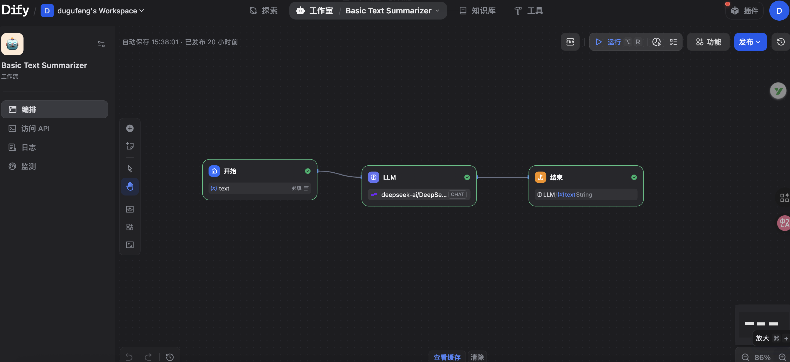
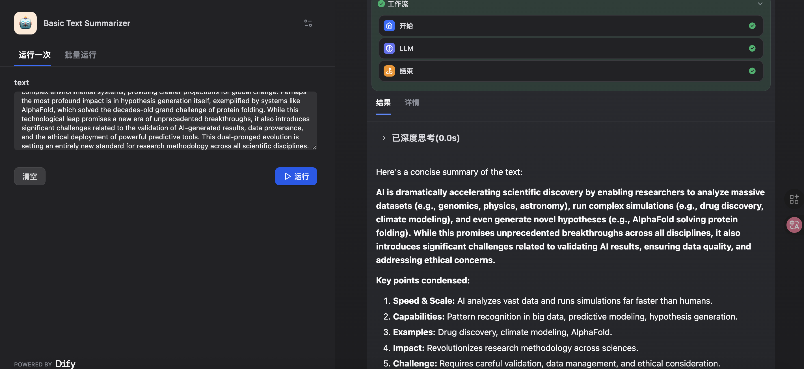

# Basic Text Summarizer

**Author:** `dugufeng`
**Tags:** `language:english`, `example`, `beginner`, `text-processing`, `llm`
**Dify Version:** `v1.9.2+`(Please fill in the Dify version you have tested this workflow on)

A simple workflow that takes a long piece of text and returns a concise summary.

## 🚀 How to Use

1.  **Set Up API Keys:**
    * This workflow uses the default Dify LLM provider (e.g., OpenAI).
    * Ensure you have a valid API key (like `OPENAI_API_KEY`) set up in your Dify 'Credentials'.
2.  **Run the Workflow:**
    * Provide the text you want to summarize in the 'Start' node's `text` variable.
    * Run the workflow and check the 'End' node for the `summary` output.

## 🛠️ Workflow Nodes

* **Start Node:** Receives the input `text` (string).
* **LLM Node:** A simple Large Language Model call with a prompt like: `Please summarize the following text: {{text}}`
* **End Node:** Returns the output `summary` (string).

## 📸 Screenshots (Highly Recommended)

### Workflow Graph

### Example Run
